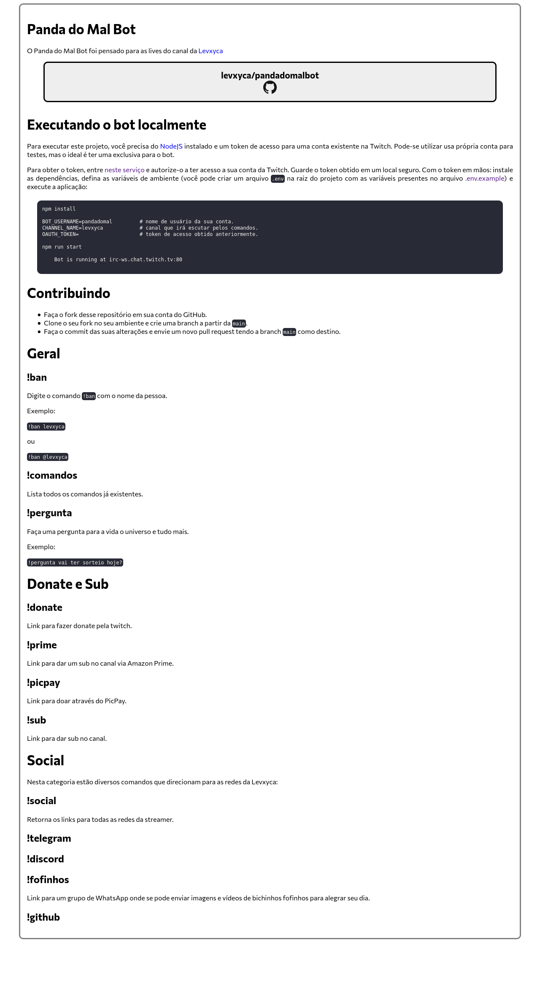

# Site do Pandadomalbot

Este é o site oficial do pandadomalbot, contendo informações sobre o bot, e um link para o Github do projeto.

# Desenvolvimento

Use `yarn serve` para inciar o servidor, fazer suas mudanças e executar `yarn build` para gerar o diretório `dist/` que será enviado á produção.
